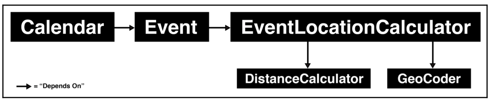

# Solid

Specifically, it is an acronym that stands for five specific object-oriented programming (OOP) design principles

- Single responsibility principle (SRP)
- Open-closed principle
- Liskov substitution principle
- Interface segregation principle
- Dependency inversion principle

## Single responsibility principle

Responsibility here refers to the purpose and area of concern that your abstraction encompasses.

### Example : Building a calendar application

We need to distinct abstractions

`Event` class - contain time and meta information about an event.
`Calendar` class - contain events.

Initially, Calendar class can add/remove events.

```js
class Calendar {
  addEvent(event) {
    /*...*/
  }
  removeEvent(event) {
    /*...*/
  }
}
```

Eventually we had to add methods for retrieving events within specific dates, and meethods to export events in various formats:

```js
class Calendar {
  addEvent(event) {
    /*...*/
  }
  removeEvent(event) {
    /*...*/
  }
  getEventsBetween(stateDate, endDate) {
    /*...*/
  }
  setTimeOfEvent(event, startTime, endTime) {
    /*...*/
  }
  setTitleOfEvent(event, title) {
    /*...*/
  }
  exportFilteredEventsToXML(filter) {
    /*...*/
  }
  exportFilteredEventsToJSON(filter) {
    /*...*/
  }
}
```

Even without implementations, you can see how the addition of all of these methods has created a far more complex class.

If we question : _How many reasons does our abstraction's design have to change?_

- The way time is defined on events may need to change
- The way titles are defined on events may need to change
- The way events are searched for may need to change
- The XML schema may need to change
- The JSON schema may need to change

Given the number of different reasons for potential change, it makes sense to split the change into more appropriate abstractions.

**For setting Time and Titles**

- Definitely make sense within the `Event` class itself, as they're highly related to the purpose of the `Event` class

**Export to JSON and XML**

- perhaps move into their own class that is solely responsible for the export logic.

**Code Update**

```js
class Event {
  setTime(startTime, endTime) {
    /*...*/
  }
  setTitle(title) {
    /*...*/
  }
}

class Calendar {
  addEvent(event) {
    /*...*/
  }
  removeEvent(event) {
    /*...*/
  }
  getEventsBetween(startDate, endDate) {
    /*...*/
  }
}

class CalendarExporter {
  exportFilteredEventsToXML(filter) {
    /*...*/
  }
  exportFilteredEventsToJSON(filter) {
    /*...*/
  }
}
```

Each one encapsulates its responsibilities far more cohesively than would be the case if all of that functionality resided solely within the Calendar class.

The SRP(Single Responsibility Principle) is not only about creating abstractions that are simple to use and maintain, it also allows us to write code that is more focused on its key purpose.

Being more focused in this way gives us a clearer path to optimize and test our units of code, which benefits the reliability and efficiency of our codebase.

## Open-closed principle

_Software entities (classes, modules, functions, and so on) should be open for extension, but closed for modification._

When crafting abstractions, we should enable them to be open to extension so that other developers can come along and build upon their behavior, adapting the abstraction to suit their needs.

### Example : Render notification

Consider the following `Event` class and _renderNotification_ method from our `Calendar` application:

```js
class Event {
    renderNotification(){
        return `You have an event occuring in ${this.calcMinutesUtil())} minutes!`
    }
}
```

A child class may want to render the above notification with `Urgent!` in the message.

```js
class ImportantEvent extends Event {
  renderNotification() {
    return `Urgent! ${super.renderNotification()}`;
  }
}
```

Inheritance is only one way that extension can be achieved. Since we do not to change whats already there.

Another implementation could be (if we knew we would change the text)

```js
class Event {
  renderNotification() {
    const defaultNotification = `You have an event occuring in ${this.calcMinutesUtil()} minutes!`;
    return this.renderCustomNotification
      ? this.config.renderCustomNotification(defaultNotification)
      : defaultNotification;
  }
}
```

This code presumes that there is a `config` object available.

Providing adaptability via configuration means that users don't need to worry about the internal implementation knowledge required when extending classes. The path to adaption is simplified.

```js
new Event({
  title: "Doctor Appointment",
  config: {
    renderCustomNotification: (defaultNotification) => {
      return `Urgent! ${defaultNotification}`;
    },
  },
});
```

But it is hard to forsee all of the future implementations. Adaptability is a good thing, but we also must balance it with a focused and cohesive abstraction thathas a constrained purpose.

## Liskov substitution principle

- Types should be able to be replaced by their subtypes wihtout altering the reliability of the program.
- A consumer of typ should only be concerned with the least specific type necessary to operate it reliably.

For example, if we were to program a `Drvier` abstraction in code, we would wnat it to interface generally with `Car` abstractions rather than writing specific code that relies on specific models of car (such as the Volvo XC90).

Using the previous open-closed principle,

```js
class ImportantEvent extends Event {
  renderNotification() {
    return `Urgent! ${super.renderNotification()}`;
  }
}
```

The assumption implicit in our doing this is that our `Calendar` class and its implementation wil not be concerned with whether `Events` or subclasses of `Events`.

In the end, a subclass of a class must behave as expected for the functions implemented for the super class. Users who are using the code must not be concerned about functions of subclass methods that are from superclass.

## Interface segregation principle

- Keeping interfaces highly cohesive, engaged in only one task or a set of tasks that are highly related.

- No client should be forced to depend on methods that it does not use.

- Ensure that you create focused and highly-cohesive abstractions that are only concerned with a single area of responsibility.

### Example : Local government office.

They have a paper form (Form 1A) that is used to change a person's details.

Via this form, a local citizen can

- change name
- change marital status
- change address
- change council tax discount status
- change disability status

As it is obvious, Form 1A does not follow the interface segregation principle very well. A single paper form contains all of the inputs that are not required for one another.

We can solve this by using LoD(least).

What's the least amount of information each abstraction requires?

Interface segregation principle

- increased reliability
  - easier to test and verify
  - increases reliability and stability over time
- Increased maintainability
  - changes do not affect the others.
- increased usability
  - users can understand and navigate interfaces with far less time and cognitive effort.

## Dependency inversion principle

- High-level modules should not depend on low-level modules. Both should depend on abstractions (that is, interfaces)
- Abstractions should not depend on details. Details (such as concrete implementations) should depend on abstractions.

We decouple the hig-level from low-level via intermediary abstractions through which the high-level modules can interface with the low-level details. These intermediary abstractions are sometimes known as adapters, as they adapt a low-level abstraction for consumption by a high-level abstraction.

### Example : Calendar application

We want to implement a way to retrieve events happening within a specific radius of a fixed location.

```js
class Calendar {
  getEventsAtLocation(targetLocation, kilometerRadius) {
    const gecoder = new GeoCoder();
    const distanceCalc = new DistanceCalculator();

    return this.events.filter((event) => {
      const eventLocation = event.location.address
        ? geocoder.geocode(event.location.address)
        : event.location.coords;
      return (
        distanceCalc.haversineFormulatDistance(eventLocation, targetLocation) <=
        kilometerRadius / 1000
      );
    });
  }
}
```

In order to get events within a certain radius, it uses both a `Geocoder` class and a `DistanceCalculator` class to achieve its purpose.

The `Calendar` class is a high-level abstraction, concerned with the broad concepts of a calendar and its events. The `getEventsAtLocation` method, however, contains a lot of a location-related details that are more of a low-level concern.

You can see how the `kilometerRadius` argument must be divided by `1000` to get the distance in meters, which is then compared to the distance returned from the `haversineFormulaDistance` method.

All of these details should not be the business of a high-level abstraction, such as `Calendar`.

The **dependency inversion principle** asks us to consider how we can abstract away these concerns to an intermediary abstraction that acts as a bridge between high-level and low-level.

### Solution

We can accomplish this via a new class, `EventLocationCalculator`

```js
const distanceCalculator = new DistanceCalculator();
const geocoder = new GeoCoder();
const METERS_IN_KM = 1000;

class EventLocationCalculator {
  constructor(event) {
    this.event = event;
  }
  geoCoords() {
    return this.event.location.address
      ? geocoder.geocode(this.event.location.address)
      : this.event.location.coords;
  }
  calculateDistanceInKilometers(targetLocation) {
    return (
      distanceCalculator.haversineFormulaDistance(
        this.geoCoords(),
        targetLocation
      ) / METERS_IN_KM
    );
  }
}

class Event {
  constructor() {
    //...
    this.locationCalculator = new EventLocationCalculator();
  }
  isEventWithinRadiusOf(targetLocation, kilometerRadius) {
    return (
      locationCalculator.calculateDistanceInKilometers(targetLocation) <=
      kilometerRaidus
    );
  }
}

class Calendar {
  getEventsAtLocation(targetLocation, kilometerRadius) {
    return this.events.filter((event) => {
      return event.isEventWithinRadiusOf(targetLocation, kilomterRadius);
    });
  }

  //...
}
```



## The abstraction principle

_Implementation should be separate from interface_

The craft of creating abstractions that separate implementation from interface to just the right degree is not as simple as it may seem.

- **Don't repeat yourself (DRY)**
  - Avoid writing code that duplicates other code we have written.
- **You aren't gunna need it (YAGNI)**
  - Be wary of over-abstracting code that does not need to be abstracted.
  - We should not attempt abstraction unless it's warranted.

Somewhere between these two warnings, lies the perfect abstraction.

### Over-abstraction

When too much complexity has been removed or replaced, so that the underlying complexity becomes difficult to leverage.

#### Example

We need a gallery abstraction that we want to use to display a gallery on both our website and various mobile applications.

Depending on the platform, the gallery will use the interfaces available to produce the layout.

On Web, it renders HTML and DOM. On mobile, it renders various native UI SDKs available.

**Requirements**

- Display one or more images
- Display captions alongside images
- Control the dimensions of individual images

**Assumption**

- External team has created a Gallery component.

```js
const gallery = new GalleryComponent([
  new GalleryComponentImage(
    new GalleryComponentImage.PathOfImage("JPEG", "/foo/images/Picture1.jpg"),
    new GalleryComponentImage.Options({
      imageDimensionWidth: { unit: "px", amount: 200 },
      imageDimensionHeight: { unit: "px", amount: 150 },
      customStyleStrings: ["border::yellow::1px"],
    })
  ),
  [
    new GalleryComponentImage.SubBorderCaptionElementWithText({
      content: { e: "paragraph", t: "The caption for this employee" },
    }),
  ],
  new GalleryComponentImage(
    new GalleryComponentImage.PathOfImage("JPEG", "/foo/images/Picture2.jpg"),
    new GalleryComponentImage.Options({
      imageDimensionWidth: { unit: "px", amount: 200 },
      imageDimensionHeight: { unit: "px", amount: 150 },
      customStyleStrings: ["border::yellow::1px"],
    })
  ),
  [
    new GalleryComponentImage.SubBorderCaptionElementWithText({
      content: { e: "paragraph", t: "The caption for this employee" },
    }),
  ],
]);
```

This interface seems very complex for the basic purpose of only displaying a couple images.

An abstraction like this, which encodes new complexities and presribes its own features and naming conventions, is at risk of not only failing to reduce complexity, but also increasing it. b

### Over-Simplification

Levers to the underlying complexity are not made available to us. An oversimplified version of our `GalleryComponent` interface may look like the following

```js
const gallery = new GalleryComponent(
  "/foo/images/PictureOne.jpg",
  "/foo/images/PictureTwo.jpg"
);
```

Having gone through the two previous examples, you've seen how over-abstraction can come in two distict flavors: one that over-complicates and one that over-simplifies.

### Under-abstraction

It is when _too little_ complexity has been removed or replaced. This is when the user of the abstraction needs to concern themselves with the underlying complexity.

#### Example

```js
const gallery = new GalleryComponent({
  web: [
    () => {
      const el = document.createElement("div");
      el.className = "gallery-container";
      return el;
    },
    {
      data: [
        `
 <span>The caption</span>`,
        `
 <span>The caption</span>`,
      ],
    },
  ],
  android: [
    (view, galleryPrepData) => {
      view.setHasFixedSize(true);
      view.setLayoutManager(new GridLayoutManager(getApplicationContext(), 2));
      return new MyAdapter(getApplicationContext(), galleryPrepData());
    },
    {
      data: [
        ["/foo/images/PictureOne.jpg", 200, 150, "The Caption"][
          ("/foo/images/PictureTwo.jpg", 200, 150, "The Caption")
        ],
      ],
    },
  ],
});
```

This version seems to force us to define web-specific HTML and Android-specific code. We were ideally depending on the abtraction to hide this complexity from us, giving us a simplified interface with which to harness-it hasn't done this.

Also we are repeating the image source URL and the caption text. This violates the warning, DRY.

### Balanced abstraction

Balanced abstraction is one that sits neatly in between these two undesirable opposites.

### Example: Gallery Component

From `GalleryComponent`, we should explore the requirements of the abstraction:

- display one or more images
- display captions alongside images
- ability to control the dimensions of individual images

```js
const gallery = new GalleryComponent([
  {
    src: "/foo/images/PictureOne.jpg",
    caption: "The Caption",
    width: 200,
    height: 150,
  },
  {
    src: "/foo/images/PictureTwo.jpg",
    caption: "TheCaption",
    width: 200,
    height: 150,
  },
]);
```

Via this interface, we can define one or more images, set their dimensions, and define captions for each image. It fulfills all of the requirements wihtout inviting new complexities or leaking complexities from underlying implementation.

## Functional programming principles

It is easy to observe and discuss the difference between OOP and functional programming by exploring an example.

### Class

### Example : A mechanism to fetch paginated data from server

To Achive this, we might create a `PaginatedDataFetcher` class.

```js
class PaginatedDataFetcher {
  constructor(endpoint, startingPage) {
    this.endpoint = endpoint;
    this.nextPage = startingPage || 1;
  }

  getNextPage() {
    const response = fetch(`/api/${this.endpoint}/${this.nextPage}`);
    this.nextPage++;
    return fetched;
  }
}
```

and the following is an example of how you would use the `PaginatedDataFetcher` class:

```js
const pageFetcher = new PaginatedDataFetcher("account_data", 30);

await pageFetcher.getNextPage(); // Fetches /api/account_data/30
await pageFetcher.getNextPage(); // Fetches /api/account_data/31
await pageFetcher.getNextPage(); // Fetches /api/account_data/32
```

The `getNextPage` method relies on the remembered state of its objects, `endpoint` and `nextPage`, in order to know which URL to request next.

### Term : State

A **state** can be thought of as the underlying remembered data of any program or piece of code that its results or effects are derived from.

For a car, it could be its feul, current upkeep, and oil levels, and so on.

### Functional Programming

As distinct from OOP, is purely interested in the usage of functions and immutable state to achieve its goals.

We can achieve the same behavior of `getPage` as follows.

#### Example : Get Page

```js
const getPage = async (endpoint, pageNumber = 1) => ({
  endpoint,
  pageNumber,
  response: await fetch(`/api/${endpoint}/${pageNumber}`),
  next: () => getPage(endPoint, pageNumber + 1),
});
```

When called, the `getPage` function will return an object containing the response from the server, as well as the `endpoint` and `pageNumber` used.

```js
const page1 = await getPage("account_data");
const page2 = await page1.next();
const page3 = await page2.next();
```

Using this pattern, we only need a reference to the last retrieved page in order to make the next request.

Our `getPage` function does not mutate any data. It only uses the passed data to derive new data, and therefore, it employs immutability. Functional puritty and immutability are among the most vital functional concepts to understand, and, usefully, are the principles that are applicable to all paradigms of programming.

## Functional purity.

Function can be pure when their return value is only derived from their input values (also called \_\_idempotence), and when there are no side-effects.

- Predictability
- Testability
